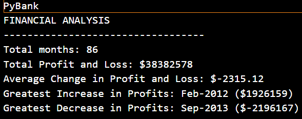
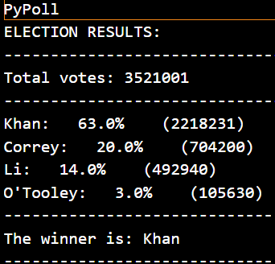

# python-challenge

Python Py Me Up, Charlie

PyBank:

 Created a Python script that analyzes the Financial records of a company to calculate each of the following:

  * The total number of months included in the dataset

  * The net total amount of "Profit/Losses" over the entire period

  * Calculated the changes in "Profit/Losses" over the entire period, then find the average of those changes

  * The greatest increase in profits (date and amount) over the entire period

  * The greatest decrease in profits (date and amount) over the entire period

 

PyPoll: 
 

 Created a Python script that analyzes the votes and calculates each of the following:

  * The total number of votes cast

  * A complete list of candidates who received votes

  * The percentage of votes each candidate won

  * The total number of votes each candidate won

  * The winner of the election based on popular vote.

 

Code in the main Github repository is organised as follows:
Final code has been saved to the Github repository python-challenge.
Python-challenge folder contains a folder for PyBank and PyPoll.
Folders PyBank and PyPoll each contain the main code to mainpybank.py and mainpypoll.py and a Resources folder. 
The analysis folder is located in each folder of PyBank and PyPoll which contains the printed output.
VS Code was utilzed to write the python script.
I have created a git ignore on my resources folder due to the size of the data used.

